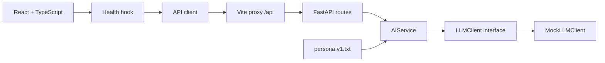

# Kiến trúc

Cập nhật: 2026-10-04.

- Router kiểm tra request bằng Pydantic, gọi service và chuyển timeout thành HTTP 504.
- Service chịu trách nhiệm cung cấp prompt/ngữ cảnh. Provider SDK từ bước tiếp theo chỉ nằm trong `llm/`.
- Application factory tạo app riêng cho integration test; dependency override mô phỏng lỗi không gọi mạng.
- UI/hook/API client tách trách nhiệm. Hook hủy request khi unmount và bỏ qua kết quả đến muộn.
- Không có DB hay state nghiệp vụ trong khung hiện tại. `db/`, `models/`, `store/` dành cho bước tiếp theo.
- Docker là stack dev gồm hai dịch vụ; frontend dùng Vite proxy để nối API. Production frontend build xuất `dist/`, chưa có cấu hình triển khai production.
- `scripts/manage.py` là nơi định nghĩa lệnh dùng chung, không ghép chuỗi lệnh shell. `make.cmd` và Makefile chỉ là wrapper.

ERD, giao dịch DB và giao thức streaming sẽ bổ sung khi triển khai backlog tương ứng.
