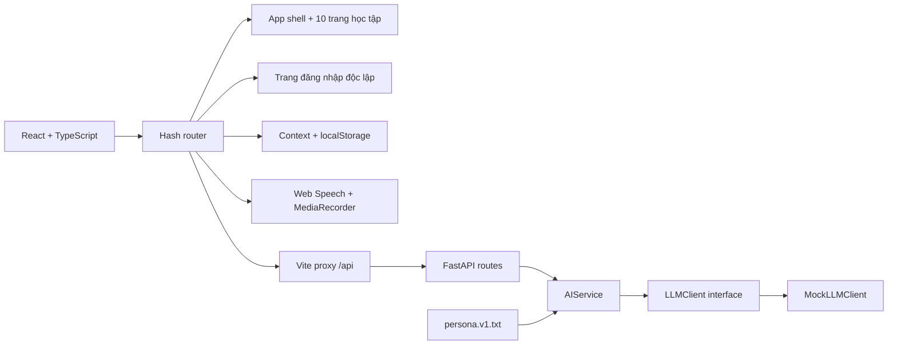

# Kiến trúc

Cập nhật: 2026-10-07.

- Router kiểm tra request bằng Pydantic, gọi service và chuyển timeout thành HTTP 504.
- Service chịu trách nhiệm cung cấp prompt/ngữ cảnh. Provider SDK từ bước tiếp theo chỉ nằm trong `llm/`.
- Application factory tạo app riêng cho integration test; dependency override mô phỏng lỗi không gọi mạng.
- App tự quản lý hash route để bản demo không cần thêm router dependency. Menu desktop/mobile, header và footer dùng chung cho 10 trang học tập. Route đăng nhập dùng bố cục riêng, không render sidebar/topbar học tập.
- `demo/LuuTru.tsx` cung cấp Context cho hồ sơ, từ vựng, thống kê, lịch ôn và cài đặt; dữ liệu được kiểm tra trước khi đọc từ `localStorage` và lỗi ghi được báo trên giao diện. Cài đặt mới dùng cùng khóa `engmate-demo-v1`, bổ sung giá trị mặc định cho dữ liệu cũ hoặc tùy chọn sai định dạng, giữ hồ sơ và lịch ôn.
- Route `#dang-nhap` render trang độc lập `TaiKhoan` cho đăng nhập/đăng ký/khôi phục. Alias `#tai-khoan` và `#cai-dat?muc=tai-khoan` cũng resolve về route này. `CaiDat` chỉ chứa giao diện và âm thanh. Hai bố cục dùng cùng provider `LuuTru` để giữ hồ sơ, theme và phiên khi chuyển trang. Khách vẫn được học; đăng nhập thành công có nút về tổng quan.
- `DangNhapMangXaHoi` render nút/logo Google/Facebook/GitHub và callback chọn nhà cung cấp; hiện chỉ báo chưa khả dụng, không gọi OAuth hoặc thay phiên. `TaiKhoan` dùng khung hai nửa (form + panel Mate): panel và form đổi chỗ bằng CSS `translate` khi đăng nhập ↔ đăng ký; form “mở cuộn” theo hướng với clip-path/xoay nhẹ; sóng viền và hiệu ứng phụ. Chỉ một form tại mỗi thời điểm, giữ email/tên, tạo lại ô mật khẩu. Web Animations API co giãn chiều cao khung; mobile xếp dọc + pill chuyển chế độ. Không thêm dependency; giảm chuyển động dừng CSS/WAAPI và dọn listener khi unmount.
- `MenuNguoiDung` hiển thị Đăng nhập khi chưa đăng nhập, Hồ sơ học tập/Đăng xuất khi đã đăng nhập; mở qua hover/click, đóng qua mouseleave, blur, pointer ngoài, Escape hoặc chuyển route. Trạng thái phiên vẫn ở localStorage, chưa có xác thực backend.
- Provider áp dụng giao diện sáng/tối/theo hệ thống, giảm chuyển động và tốc độ đọc lên dataset của document; listener `matchMedia` được dọn khi đổi tùy chọn/unmount. CSS dùng dataset cho theme/motion; `docTiengAnh` nhân tốc độ câu với tùy chọn đọc của người học.
- Stylesheet chung dùng biến màu `--surface`, `--surface-soft`, `--text`, `--muted`, `--line` và `--accent` cho cả hai theme. `TieuDeTrang` chỉ nhận tên và thao tác; nội dung giải thích phụ được bỏ hoặc đưa vào `details`/nút mở theo ngữ cảnh. Trang đăng nhập dùng biểu mẫu giữa trang; giao diện học tập có breakpoint drawer ở 800 px và bố cục một cột khi cần.
- `components/LinhThu.tsx` tạo Mate bằng CSS với tỷ lệ chung, kích thước và năm biểu cảm; các trang truyền trạng thái bài học/ghi âm/phản hồi để chọn dáng. `components/TrangTri.tsx` thêm quỹ đạo/sao/bong bóng quanh Mate cho banner và đăng nhập. Hình có `aria-hidden` và không nhận tương tác; trạng thái quan trọng vẫn được thể hiện bằng chữ. `public/mate.svg` là bản vector tĩnh; quy ước nhận diện ghi ở `docs/LINH_THU.md`.
- Wrapper `page-view` có khóa hash để chạy hiệu ứng vào trang; state học tập bền vững vẫn nằm trong Context. CSS keyframes xử lý chuyển động/hover/stagger; không có thư viện animation hoặc vòng cập nhật JavaScript. Biến màu violet/coral/cyan bổ sung nền trang trí theo theme. Tất cả hiệu ứng tắt khi `prefers-reduced-motion: reduce` hoặc dataset giảm chuyển động được bật.
- Trang hội thoại gọi endpoint hiện có qua Vite proxy và hủy request khi unmount. Ghi âm/phát âm dùng API trình duyệt, có trạng thái fallback.
- UI health cũ cùng hook/API client vẫn được giữ để kiểm tra backend độc lập, nhưng không nằm trong route chính của bản demo.
- Không có DB hay state nghiệp vụ trong khung hiện tại. `db/`, `models/`, `store/` dành cho bước tiếp theo.
- Docker là stack dev gồm hai dịch vụ; frontend dùng Vite proxy để nối API. Production frontend build xuất `dist/`, chưa có cấu hình triển khai production.
- `scripts/manage.py` là nơi định nghĩa lệnh dùng chung, không ghép chuỗi lệnh shell. `make.cmd` và Makefile chỉ là wrapper.

## Database đã thiết kế, chưa tích hợp

Theo yêu cầu ngày 2026-10-07, database mục tiêu là **SQL Server**, thay phương án PostgreSQL trong backlog. [Thiết kế SQL Server](DATABASE_SQLSERVER.md) có khảo sát toàn bộ UI, ERD, 22 bảng, 2 view, ánh xạ localStorage và quy tắc transaction. Script ở `database/sqlserver/` gồm migration tạo schema một lần, seed danh mục, views, truy vấn mẫu và kiểm thử trên SQL Server thật có rollback.

Luồng dự kiến: React → API xác thực → service → repository → SQL Server. AI chạy ngoài transaction DB; media nằm ở kho file, DB lưu metadata. StudySessions là nguồn thời lượng; FlashcardReviews là nguồn lượt ôn; view tổng hợp dashboard. Khóa ghép bảo đảm đúng owner/loại bài; ClientRequestId và rowversion hỗ trợ retry và cập nhật đồng thời.

Đây là kiến trúc đích: mã backend hiện vẫn chưa có kết nối/ORM/migration runner/auth. Các endpoint hiện tại và cách chạy app giữ nguyên. Streaming cần hợp đồng riêng khi thực hiện backlog; thiết kế đã dự phòng trạng thái pending/completed/failed/cancelled của tin nhắn.
