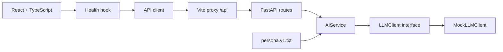

# Kiến trúc

Cập nhật: 2026-10-07.

- Router kiểm tra request bằng Pydantic, gọi service và chuyển timeout thành HTTP 504.
- Service chịu trách nhiệm cung cấp prompt/ngữ cảnh. Provider SDK từ bước tiếp theo chỉ nằm trong `llm/`.
- Application factory tạo app riêng cho integration test; dependency override mô phỏng lỗi không gọi mạng.
- UI/hook/API client tách trách nhiệm. Hook hủy request khi unmount và bỏ qua kết quả đến muộn.
- Không có DB hay state nghiệp vụ trong khung hiện tại. `db/`, `models/`, `store/` dành cho bước tiếp theo.
- Docker là stack dev gồm hai dịch vụ; frontend dùng Vite proxy để nối API. Production frontend build xuất `dist/`, chưa có cấu hình triển khai production.
- `scripts/manage.py` là nơi định nghĩa lệnh dùng chung, không ghép chuỗi lệnh shell. `make.cmd` và Makefile chỉ là wrapper.

## Database đã thiết kế, chưa tích hợp

Theo yêu cầu ngày 2026-10-07, database mục tiêu là **SQL Server**, thay phương án PostgreSQL trong backlog. [Thiết kế SQL Server](DATABASE_SQLSERVER.md) có khảo sát toàn bộ UI, ERD, 22 bảng, 2 view, ánh xạ localStorage và quy tắc transaction. Script ở `database/sqlserver/` gồm migration tạo schema một lần, seed danh mục, views, truy vấn mẫu và kiểm thử trên SQL Server thật có rollback.

Luồng dự kiến: React → API xác thực → service → repository → SQL Server. AI chạy ngoài transaction DB; media nằm ở kho file, DB lưu metadata. StudySessions là nguồn thời lượng; FlashcardReviews là nguồn lượt ôn; view tổng hợp dashboard. Khóa ghép bảo đảm đúng owner/loại bài; ClientRequestId và rowversion hỗ trợ retry và cập nhật đồng thời.

Đây là kiến trúc đích: mã backend hiện vẫn chưa có kết nối/ORM/migration runner/auth. Các endpoint hiện tại và cách chạy app giữ nguyên. Streaming cần hợp đồng riêng khi thực hiện backlog; thiết kế đã dự phòng trạng thái pending/completed/failed/cancelled của tin nhắn.
