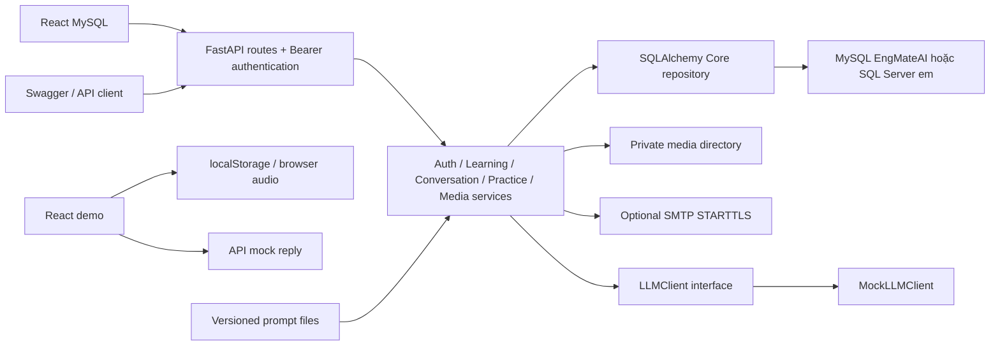

# Kiến trúc

Cập nhật: 2026-10-09. Frontend MySQL gọi API nghiệp vụ/JWT; demo giữ localStorage. Backend chọn MySQL/PyMySQL hoặc SQL Server/pyodbc, không tự chạy DDL.

- Pydantic kiểm tra dữ liệu và giới hạn theo cột SQL, kể cả độ dài UTF-16. Router xác thực JWT và chuyển lỗi thành response không chứa SQL, mật khẩu hoặc token. Middleware giới hạn body 10 MiB, request auth và đặt `no-store` cho API.
- SQLAlchemy Core reflect danh sách bảng/view được phép từ schema hiện có; không dựng một bộ schema ORM thứ hai. Engine khởi tạo lazy, dùng pyodbc và connection pool. Không có DDL tự chạy khi khởi động.
- `python scripts/manage.py migrate-backend` chạy các script 001–003 trong database người vận hành đã tạo; kiểm tra schema version, seed chạy lại được và cập nhật views. Version không hỗ trợ bị từ chối.
- Auth dùng Argon2, JWT access và refresh token chỉ lưu hash. Mỗi request kiểm tra phiên trong DB để logout/reset/đổi mật khẩu thu hồi access token ngay. Media nằm ngoài web root, DB lưu metadata; tải file yêu cầu Bearer và đúng owner.
- Ghi dữ liệu học tập trong transaction; khóa user phối hợp thao tác và dùng rowversion cho sửa dữ liệu. Request UUID bảo đảm retry không ghi trùng; dùng lại UUID với payload khác trả 409. Khóa ghép SQL bảo vệ ownership và quan hệ bài/câu hỏi/lựa chọn.
- Pyodbc là driver đồng bộ. Các pha SQL của chat/luyện tập và xử lý media chạy trong worker thread; gọi LLM async ngoài transaction và có timeout. Tin nhắn/evaluation giữ trạng thái pending/completed/failed/cancelled; kết quả đến muộn không hồi sinh evaluation đã hủy.
- StudySessions cung cấp thời lượng server tính; FlashcardReviews cung cấp lượt ôn. View tổng/ngày không join nhân dữ liệu. Ngày thống kê là ngày địa phương lúc hoàn thành phiên, chưa chia thời lượng qua nửa đêm; phiên bỏ dở không được cộng thời gian.
- AI hiện là mock. Kết quả ghi `provider=mock`, không tạo điểm/phân tích AI thật. Listening chấm bằng đáp án SQL; answer key chỉ trả sau nộp, nhưng nội dung bài nghe vẫn có transcript phục vụ browser TTS của UI demo.
- Docker dev gồm backend/frontend và volume media; database SQL Server là dịch vụ ngoài stack. Backend image có ODBC Driver 18 và ffmpeg. Frontend có 12 trang học tập và đăng nhập độc lập, Mate, theme/motion và dữ liệu trình duyệt; production static hosting chưa cấu hình.
- `scripts/manage.py` tập trung các lệnh local/CI; Makefile và `make.cmd` là wrapper. OpenAPI xuất bằng `export-api` để nhập Postman.

## Giao diện mới

- Prompt bảy mức nằm ở `persona.v2.txt`, service và hội thoại mới dùng cùng phiên bản; giữ nguyên v1 và snapshot các hội thoại cũ.
- `demo/trinhDo.ts` định nghĩa bảy mức Pre-A1 đến C2, mục tiêu và đề Speaking/Writing. `LoTrinhHoc` lưu chặng tự chọn vào hồ sơ; `NenTangTiengAnh` dạy chữ cái/số/lời chào qua Web Speech. Bài kỹ năng đọc tham số `trinh-do` hợp lệ, sau đó fallback trình độ hồ sơ; query không đổi hồ sơ trừ khi bấm liên kết từ lộ trình. `baiNghe.ts` và `baiDocBoSung.ts` bổ sung nội dung theo cả bảy mức. LocalStorage cũ giữ tương thích; hồ sơ mới mặc định Pre-A1. Schema/prompt của API mock không lưu chấp nhận bảy mức; API SQL v1 có kiểu mức riêng A2/B1/B2 để giữ ràng buộc database.
- Reading dùng `demo/baiDoc.ts` chứa bài đọc, câu hỏi, đáp án, giải thích và từ vựng. `pages/LuyenDoc.tsx` quản lý lựa chọn và kết quả tại trang; đổi bài/làm lại xóa đáp án. Chấm trực tiếp từ đáp án biên soạn, không gọi AI. Lưu từ và ghi nhận 5 phút qua Context hiện có; Set ở trang ngăn cộng phút lặp cùng bài trong một lần mở trang, không phải bộ đo thời gian thực. Không thêm endpoint hoặc dependency.
- Khi `daDangNhap && !daLamQuen`, `KhungTrang` hiển thị `LamQuenCungMate` trước mọi route học tập/tài khoản và đặt tiêu đề trang tương ứng. `demo/lamQuen.ts` ánh xạ bảy mô tả gần gũi sang `TrinhDo`; xem trước chỉ đổi state tại trang, xác nhận mới cập nhật hồ sơ/`daLamQuen` và chuyển tổng quan. Radio native, focus heading và live status hỗ trợ bàn phím/trình đọc màn hình. Cờ được lưu cùng khóa `engmate-demo-v1`; dữ liệu thiếu cờ được hiểu là chưa làm quen, giữ nguyên hồ sơ/thống kê/từ vựng. Đăng xuất giữ cờ, đăng ký mới đặt lại false. Không thêm API hoặc dependency.

Giao diện và `/api/ai/reply` hỗ trợ Pre-A1/A1/A2/B1/B2/C1/C2. Schema SQL Server v1 và API lưu hồ sơ/hội thoại chỉ nhận A2/B1/B2; mức ngoài phạm vi trả 422 trước khi ghi DB. Reading, nhập môn và cờ làm quen hiện lưu cục bộ, chưa có API SQL tương ứng. Muốn lưu đủ bảy mức cần migration được review trước khi nối UI với SQL.

Chi tiết thiết kế: [SQL Server](DATABASE_SQLSERVER.md). Hợp đồng endpoint: [API](API.md). OAuth, email verification, streaming và adapter LLM thật nằm trong [kế hoạch tiếp theo](IMPLEMENTATION_PLAN.md).

## Adapter speech Blaze

Speech routes → SpeechService → HTTPS Blaze. TTS tạo/poll/download job và trả MP3; STT gửi multipart rồi trả transcript. httpx là runtime dependency; key là SecretStr và chỉ ở backend. JWT mặc định, demo loopback opt-in; không thay đổi DB hoặc mock chat. [Chi tiết](BLAZE_SPEECH.md).

Frontend: NutDoc → docTiengAnh → /api/speech/tts → Audio/Blob URL. useThuAm → MediaRecorder → chepLoi → /api/speech/stt → ô văn bản. Hủy request/phát audio, dừng track micro và revoke Blob URL khi rời trang. Speech dùng demo loopback hiện tại; frontend chưa quản lý JWT SQL nên cấu hình DB bật vẫn cần tích hợp auth UI riêng.

Catalog giọng: Settings → GET /api/speech/voices → Blaze options. `caiDat.giongDoc` lưu localStorage, provider đồng bộ data-speech-voice; TTS helper đọc và gửi speaker_id. Đây là cài đặt local, chưa mở rộng schema UserSettings SQL.

## Đồng bộ MySQL — 2026-10-09

MySQL có 24 bảng/2 view/7 trigger, bảy mức, Reading, TuVungBaiHoc, SpeechVoiceId và OnboardingCompletedAt. ModelCatalog ánh xạ tên logic sang bảng/view tiếng Việt. Repository chuyển UUID sang chuỗi, lấy PK sau INSERT và đọc lại UPDATE sau trigger trong cùng transaction. Version BIGINT được mã hóa hex 16 ký tự. Pool dùng READ COMMITTED, UTC, pre-ping/recycle; khóa user SELECT FOR UPDATE bảo vệ retry/chuỗi tin/refresh. Adapter SQL Server giữ schema và OUTPUT/rowversion. [Hướng dẫn](../database/mysql/README.md).

`VITE_DATA_SOURCE=mysql` chọn MysqlLuuTru: token pair chỉ trong bộ nhớ trang, refresh dùng chung và không hồi sinh phiên sau logout. Mở/tải lại trang yêu cầu đăng nhập; token sessionStorage của bản cũ được loại bỏ khi khởi tạo transport. Sau authenticate, form chờ `capNhat({daDangNhap:true})` tải dữ liệu server thành công rồi đổi hash sang Tổng quan; lỗi tải giữ form để thử lại. Context tải hồ sơ/cài đặt/stats/sổ từ từ server, tuần tự hóa ghi theo Version và tải lại sau ghi; không nhập localStorage demo. ThucHanhMySQL lấy revision bài từ catalog, lưu Attempt và nộp backend. Reading/Listening chấm ở server; dictation nghe MP3 không lộ text key. Chat lưu tin/evaluation và đọc lịch sử riêng; flashcard dùng một phiên cho deck, retry giữ UUID/rating. Dashboard dùng thời gian server và số lượt ôn, không cộng phút minh họa khi nhấn nút. AI chat/nói/viết vẫn mock có nhãn.

MySQL gửi Bearer cho speech; local-demo bypass bị tắt khi cấu hình database. SpeechVoiceId lưu qua API, key Blaze chỉ ở backend. Các mô tả localStorage/Reading client và giới hạn SQL Server v1 phía trên áp dụng cho demo hoặc adapter cũ. Migration runner từ chối MySQL bootstrap tự động; dùng `/api/ready` để xác nhận schema đã tạo.

Âm thanh: NutDoc chuẩn bị clip chính sau 250 ms hoặc khi hover/focus. amThanh giữ cache RAM LRU (32 clip/16 MiB, TTL 15 phút), key text/ngôn ngữ/giọng/tốc độ; dùng chung request giữa các caller và hủy độc lập. Cache hit gọi Audio.play ngay trong click handler. Không tự phát trước click; lỗi không cache, logout xóa audio/request. Chưa cache backend hoặc lưu audio lâu dài.
