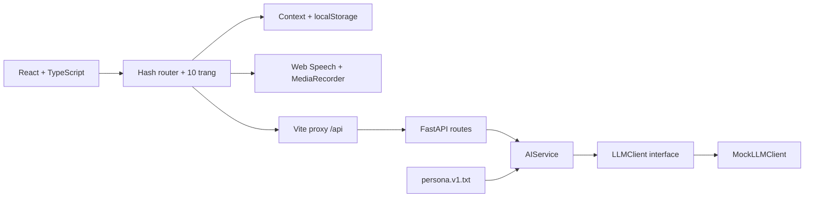

# Kiến trúc

Cập nhật: 2026-10-06.

- Router kiểm tra request bằng Pydantic, gọi service và chuyển timeout thành HTTP 504.
- Service chịu trách nhiệm cung cấp prompt/ngữ cảnh. Provider SDK từ bước tiếp theo chỉ nằm trong `llm/`.
- Application factory tạo app riêng cho integration test; dependency override mô phỏng lỗi không gọi mạng.
- App shell tự quản lý hash route để bản demo không cần thêm router dependency. Menu desktop/mobile, header và footer dùng chung cho 10 trang.
- `demo/LuuTru.tsx` cung cấp Context cho hồ sơ, từ vựng, thống kê, lịch ôn và cài đặt; dữ liệu được kiểm tra trước khi đọc từ `localStorage` và lỗi ghi được báo trên giao diện. Cài đặt mới dùng cùng khóa `engmate-demo-v1`, bổ sung giá trị mặc định cho dữ liệu cũ hoặc tùy chọn sai định dạng, giữ hồ sơ và lịch ôn.
- Route `#cai-dat` có mục Chung và Tài khoản (`?muc=tai-khoan`); alias `#tai-khoan` giữ khả năng mở phần tài khoản từ liên kết cũ. Trang đăng nhập `TaiKhoan` là nội dung bên trong `CaiDat`, không còn mục riêng trong sidebar.
- `MenuNguoiDung` hiển thị Đăng nhập khi chưa đăng nhập, Hồ sơ học tập/Đăng xuất khi đã đăng nhập; mở qua hover/click, đóng qua mouseleave, blur, pointer ngoài, Escape hoặc chuyển route. Trạng thái phiên vẫn ở localStorage, chưa có xác thực backend.
- Provider áp dụng giao diện sáng/tối/theo hệ thống, giảm chuyển động và tốc độ đọc lên dataset của document; listener `matchMedia` được dọn khi đổi tùy chọn/unmount. CSS dùng dataset cho theme/motion; `docTiengAnh` nhân tốc độ câu với tùy chọn đọc của người học.
- Trang hội thoại gọi endpoint hiện có qua Vite proxy và hủy request khi unmount. Ghi âm/phát âm dùng API trình duyệt, có trạng thái fallback.
- UI health cũ cùng hook/API client vẫn được giữ để kiểm tra backend độc lập, nhưng không nằm trong route chính của bản demo.
- Không có DB hay state nghiệp vụ trong khung hiện tại. `db/`, `models/`, `store/` dành cho bước tiếp theo.
- Docker là stack dev gồm hai dịch vụ; frontend dùng Vite proxy để nối API. Production frontend build xuất `dist/`, chưa có cấu hình triển khai production.
- `scripts/manage.py` là nơi định nghĩa lệnh dùng chung, không ghép chuỗi lệnh shell. `make.cmd` và Makefile chỉ là wrapper.

ERD, giao dịch DB và giao thức streaming sẽ bổ sung khi triển khai backlog tương ứng.
