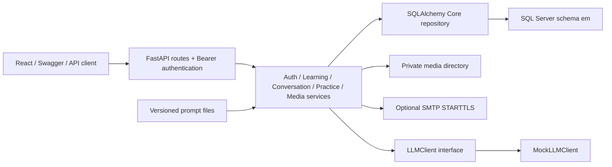

# Kiến trúc

Cập nhật: 2026-10-07. Backend nghiệp vụ nằm trên `feat/backend-learning-api`; giao diện đa trang vẫn ở nhánh riêng và chưa được nối các API nghiệp vụ.

- Pydantic kiểm tra dữ liệu và giới hạn theo cột SQL, kể cả độ dài UTF-16. Router xác thực JWT và chuyển lỗi thành response không chứa SQL, mật khẩu hoặc token. Middleware giới hạn body 10 MiB, request auth và đặt `no-store` cho API.
- SQLAlchemy Core reflect danh sách bảng/view được phép từ schema hiện có; không dựng một bộ schema ORM thứ hai. Engine khởi tạo lazy, dùng pyodbc và connection pool. Không có DDL tự chạy khi khởi động.
- `python scripts/manage.py migrate-backend` chạy các script 001–003 trong database người vận hành đã tạo; kiểm tra schema version, seed chạy lại được và cập nhật views. Version không hỗ trợ bị từ chối.
- Auth dùng Argon2, JWT access và refresh token chỉ lưu hash. Mỗi request kiểm tra phiên trong DB để logout/reset/đổi mật khẩu thu hồi access token ngay. Media nằm ngoài web root, DB lưu metadata; tải file yêu cầu Bearer và đúng owner.
- Ghi dữ liệu học tập trong transaction; khóa user phối hợp thao tác và dùng rowversion cho sửa dữ liệu. Request UUID bảo đảm retry không ghi trùng; dùng lại UUID với payload khác trả 409. Khóa ghép SQL bảo vệ ownership và quan hệ bài/câu hỏi/lựa chọn.
- Pyodbc là driver đồng bộ. Các pha SQL của chat/luyện tập và xử lý media chạy trong worker thread; gọi LLM async ngoài transaction và có timeout. Tin nhắn/evaluation giữ trạng thái pending/completed/failed/cancelled; kết quả đến muộn không hồi sinh evaluation đã hủy.
- StudySessions cung cấp thời lượng server tính; FlashcardReviews cung cấp lượt ôn. View tổng/ngày không join nhân dữ liệu. Ngày thống kê là ngày địa phương lúc hoàn thành phiên, chưa chia thời lượng qua nửa đêm; phiên bỏ dở không được cộng thời gian.
- AI hiện là mock. Kết quả ghi `provider=mock`, không tạo điểm/phân tích AI thật. Listening chấm bằng đáp án SQL; answer key chỉ trả sau nộp, nhưng nội dung bài nghe vẫn có transcript phục vụ browser TTS của UI demo.
- Docker dev gồm backend/frontend và volume media; database SQL Server là dịch vụ ngoài stack. Backend image có ODBC Driver 18 và ffmpeg. Frontend nhánh hiện tại là scaffold health/mock; production static hosting chưa cấu hình.
- `scripts/manage.py` tập trung các lệnh local/CI; Makefile và `make.cmd` là wrapper. OpenAPI xuất bằng `export-api` để nhập Postman.

Chi tiết thiết kế: [SQL Server](DATABASE_SQLSERVER.md). Hợp đồng endpoint: [API](API.md). OAuth, email verification, STT, streaming và adapter LLM thật nằm trong [kế hoạch tiếp theo](IMPLEMENTATION_PLAN.md).
