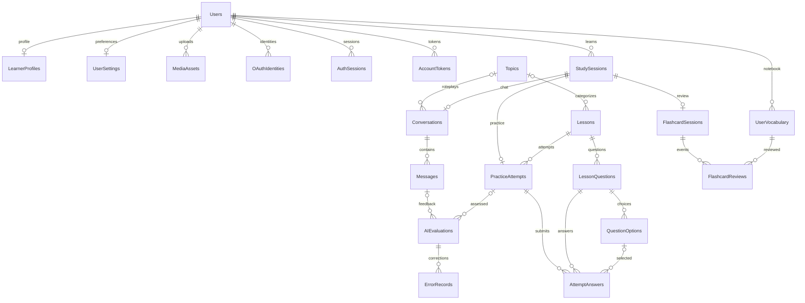

# Thiết kế cơ sở dữ liệu SQL Server — EngMate-AI

## Tương thích với UI mới — 2026-10-08

UI demo có bảy mức Pre-A1 đến C2, Reading và Mate làm quen. Schema v1 giữ nguyên: CefrLevel chỉ A2/B1/B2; catalog kỹ năng chưa có Reading và chưa có cờ làm quen. API lưu hồ sơ/hội thoại từ chối mức ngoài schema bằng 422, có unit/SQL integration test xác nhận không ghi dữ liệu. Mở rộng database cần migration riêng trước khi nối UI; merge không chạy migration trên database ứng dụng.

## Trạng thái tích hợp backend — 2026-10-07

Tài liệu dưới đây giữ bản thiết kế và khảo sát ban đầu. Backend ở `feat/backend-learning-api` hiện đã kết nối SQL Server bằng SQLAlchemy Core/pyodbc và có auth/API học tập trên schema này; các nhận xét “chưa có backend” trong khảo sát là trạng thái trước triển khai.

Xem [API](API.md), [kiến trúc](ARCHITECTURE.md) và [README chạy backend](../README.md). Migration runner `python scripts/manage.py migrate-backend` áp dụng 001–003 trong database đã được tạo và kiểm tra version; không tạo database hoặc tự chạy lúc startup. SQL artifacts không thay đổi trong tác vụ backend. Bộ API integration dùng tempdb có guard và rollback, độc lập với 45 kiểm tra T-SQL standalone.

UI đa trang/localStorage chưa chuyển sang API; OAuth, STT và LLM thật còn trong backlog. Không tự nhập counter cũ vì thiếu lịch sử từng sự kiện.

Cập nhật: 2026-10-07. Phạm vi bàn giao: thiết kế, script T-SQL, dữ liệu danh mục, truy vấn mẫu và kiểm thử database. Chưa kết nối FastAPI/React với database; chưa bật xác thực, OAuth hoặc AI thật. SQL Server thay thế phương án PostgreSQL trong backlog theo yêu cầu người dùng.

## 1. Kết quả khảo sát chương trình

Nguồn khảo sát: `README.md`, toàn bộ `frontend/src/pages`, `demo/duLieu.ts`, `demo/LuuTru.tsx`, `demo/amThanh.ts`, component tài khoản/hỗ trợ, `backend/app/api`, `schemas`, `services`, `llm`, cấu hình và tài liệu yêu cầu/kiến trúc/kiểm thử.

| Chức năng | Hiện trạng xác nhận trong mã nguồn | Dữ liệu cần lưu trên server |
| --- | --- | --- |
| Tổng quan | Phút học tổng/ngày, lượt ôn tổng/ngày, số từ, CEFR, mục tiêu ngày; không có điểm kỹ năng hay streak thật | Phiên học, lượt ôn, sổ từ, hồ sơ; tổng hợp từ dữ liệu gốc |
| Hội thoại AI | State tin nhắn trong trang; gửi `message`, `level` đến `/api/ai/reply`; backend mock không lưu lịch sử và không nhận topic/ngữ cảnh | Cuộc hội thoại, thứ tự tin nhắn, vai, trình độ, phiên bản prompt, trạng thái gửi/nhận |
| Chủ đề & nhập vai | 8 chủ đề, vai AI, câu mở đầu, độ khó A2/B1/B2 hoặc khoảng; chọn chủ đề qua hash | Danh mục chủ đề, quan hệ hội thoại, snapshot vai AI |
| Luyện nói | 3 câu shadowing, MediaRecorder tối đa 60 giây, URL blob tạm; phản hồi cố định; ghi nhận 2 phút | Bài học, bản thu, văn bản nhập/transcript, lần làm bài, phản hồi và nguồn chấm |
| Luyện nghe | 2 bài đọc bằng Web Speech; trắc nghiệm và chính tả; tốc độ riêng; ghi nhận 3 phút/lần bài/chế độ | Nội dung, câu hỏi, lựa chọn/đáp án chuẩn, lần làm và câu trả lời |
| Luyện viết | Câu ngắn/đoạn văn/email/bài luận; tối đa 5.000 ký tự; phản hồi cố định; ghi nhận 5 phút | Đề bài, bài nộp, phản hồi, lỗi ngữ pháp/từ vựng/chính tả/cấu trúc |
| Sổ từ vựng | Thêm, tìm, lọc đã thuộc, xóa; chặn trùng theo từ không phân biệt hoa/thường; từ riêng của người học | Từ, nghĩa, IPA, loại từ, ví dụ, nguồn, trạng thái và lịch ôn |
| Flashcard | Ôn từ đến hạn hoặc tất cả; Again/Hard/Good/Easy = 0/1/4/7 ngày; Again lặp trong phiên; hoàn thành ghi 3 phút | Phiên ôn, từng lượt đánh giá và lịch ôn hiện tại |
| Hồ sơ | Tên/email/tài khoản/điện thoại/ngày sinh/giới tính/avatar, CEFR, mục tiêu, 10–60 phút/ngày; ảnh hiện là data URL | Tài khoản tách hồ sơ; metadata và vị trí ảnh |
| Cài đặt | Sáng/tối/theo hệ thống, giảm chuyển động, tốc độ 0,75/1/1,25 | Tùy chọn người dùng, đồng bộ đa thiết bị |
| Tài khoản | Đăng nhập demo hard-code `abc`/`123`; đăng ký/khôi phục mô phỏng; trạng thái trong localStorage; Google/Facebook/GitHub chỉ là nút | Tài khoản thật, hash mật khẩu, định danh OAuth, phiên refresh, token dùng một lần |
| Linh thú và hỗ trợ nhanh | Hình/animation/trạng thái UI và panel hỗ trợ tĩnh | Không cần bảng riêng; không có nghiệp vụ thú nuôi hay ticket hỗ trợ |

`backend/app/db` và `models` hiện là scaffold. Hai endpoint có thật là `/api/health` và `/api/ai/reply`. Không có model, migration hoặc repository database hiện hành để chuyển đổi.

## 2. Nguyên tắc và phạm vi

- SQL Server **2019 trở lên**, kiểm chứng thực tế trên **SQL Server 2022 Developer 16.0.1200.5**. Chỉ dùng kiểu và tính năng thông dụng; khả năng tương thích 2019 chưa được chạy riêng.
- Một database `EngMateAI`, một schema nghiệp vụ `em`: **22 bảng, 2 view**. Bảng `SchemaVersions` là lịch sử migration, không phải nghiệp vụ học tập.
- Khóa nội bộ `bigint IDENTITY`; `Topics` dùng `int`; `Users.PublicId` là UUID cho định danh công khai. Không chuyển ID string trong localStorage thành khóa SQL một cách ngầm định.
- Nội dung tiếng Việt/IPA dùng `nvarchar`, seed dùng literal `N'...'`. `Username`, `Email`, `Word` dùng collation CI/AS để không phân biệt hoa thường nhưng vẫn phân biệt dấu. OAuth subject dùng so sánh nhị phân phân biệt hoa thường.
- Timestamp nghiệp vụ dùng `datetime2(3)` và UTC, mặc định `SYSUTCDATETIME()`. `BirthDate`, ngày học/ngày ôn dùng `date`; `rowversion` chỉ dùng phát hiện ghi đè, không phải thời gian.
- Hồ sơ/cài đặt quan hệ 1–1 qua PK = FK `UserId`. Nhiều quan hệ dùng khóa ghép để kiểm tra đúng chủ sở hữu hoặc đúng loại dữ liệu ngay trong SQL Server.
- Các bảng giao dịch không dùng cascade delete. Xóa tài khoản phải có transaction xóa phụ thuộc theo thứ tự; lưu trữ mềm từ vựng giúp giữ lịch sử ôn. `Users.disabled` là khóa tài khoản, không thay thế xóa dữ liệu cá nhân.
- Phút học và lượt ôn tổng/ngày lấy từ view; không ghi đồng thời nhiều bộ đếm vào hồ sơ. Chỉ lịch ôn hiện tại/cờ đã thuộc/bộ đếm từng từ được giữ như trạng thái có thể dựng lại từ lịch sử.
- Thiết kế bảng auth phục vụ UI hiện có; chưa thay đổi cấu hình xác thực của ứng dụng. Không thêm phân quyền admin, thanh toán, khóa học, thành tích hoặc bộ nhớ dài hạn vì chưa có yêu cầu nghiệp vụ tương ứng.

## 3. Sơ đồ quan hệ chính

Sơ đồ dưới thể hiện quan hệ nghiệp vụ; script SQL là nguồn chính xác cho các khóa ghép và trường nullable.



Một `StudySession` thuộc đúng một loại hoạt động. Khóa ghép + `CHECK` của bảng con ngăn cuộc hội thoại gắn vào phiên luyện viết hoặc phiên của người khác. Một phiên có tối đa một cuộc hội thoại, một lần luyện hoặc một phiên flashcard tương ứng. Việc bắt buộc tạo bảng con và đóng phiên đúng luồng nằm trong transaction của service.

## 4. Từ điển dữ liệu

Tên trường/kiểu/nullable/default đầy đủ nằm trong [001_schema.sql](../database/sqlserver/001_schema.sql). Các trường quan trọng và quan hệ:

| Bảng | Khóa và quan hệ | Nội dung / ràng buộc chính |
| --- | --- | --- |
| `SchemaVersions` | PK `Version` | Mô tả và thời điểm áp dụng migration; phiên bản đầu = 1 |
| `Users` | PK `UserId`; unique `PublicId`, `Username`, `Email` | Username 64, email 254, hash mật khẩu 512 ký tự; trạng thái active/disabled/pending; xác minh email; created/updated/rowversion |
| `LearnerProfiles` | PK/FK `UserId`; avatar FK ghép owner/purpose | Tên 60, điện thoại 32, ngày sinh, giới tính male/female/other hoặc NULL, CEFR A2/B1/B2, mục tiêu 200, 10–60 phút/ngày, múi giờ IANA |
| `UserSettings` | PK/FK `UserId` | Theme light/dark/system, ReducedMotion bit, SpeechRate decimal(3,2) 0,75/1/1,25; rowversion |
| `MediaAssets` | PK `MediaAssetId`; FK user; unique StorageKey | Purpose avatar/recording, key 450, MIME type, số byte >0, thời lượng ms; chỉ lưu metadata, file nằm ở kho file riêng |
| `OAuthIdentities` | PK ID; FK user; unique provider+subject và user+provider | Google/Facebook/GitHub; subject 255 phân biệt hoa thường; không lưu access token từ nhà cung cấp |
| `AuthSessions` | PK ID; FK user; unique RefreshTokenHash | Hash SHA-256 binary(32), created/expires/revoked; phiên refresh có hạn; không lưu access JWT plaintext |
| `AccountTokens` | PK ID; FK user; unique TokenHash | verify_email/reset_password; hash binary(32), hạn dùng và UsedAt; expiration phải sau creation |
| `Topics` | PK `TopicId`; unique Code | Tên/mô tả, vai AI, câu mở đầu, MinLevel/MaxLevel hợp lệ và có thứ tự, màu/icon, thứ tự, IsActive |
| `Lessons` | PK `LessonId`; FK topic tùy chọn; unique Code+Revision | Skill speaking/listening/writing; format shadowing/mixed/sentence/paragraph/email/essay tương ứng; tiêu đề, hướng dẫn, nội dung, audio URL tùy chọn, khoảng CEFR, phút ước lượng, published |
| `LessonQuestions` | PK ID; FK LessonId+Skill; unique lesson+position | Chỉ bài nghe; multiple_choice hoặc dictation; prompt, expected text cho dictation, giải thích và điểm >0 |
| `QuestionOptions` | PK ID; FK question+type; unique question+position | Text, IsCorrect; chỉ câu trắc nghiệm; filtered unique index cho tối đa một lựa chọn đúng |
| `StudySessions` | PK ID; FK user; unique user+ClientRequestId | Loại hoạt động, in_progress/completed/abandoned; started/ended, số giây, nguồn thời lượng, ngày địa phương, offset và snapshot mục tiêu; rowversion |
| `Conversations` | PK ID; unique StudySessionId; FK ghép session+owner+type, FK topic tùy chọn | free_chat/roleplay, tiêu đề, CEFR lúc bắt đầu, snapshot vai AI, prompt version, summary tùy chọn |
| `Messages` | PK ID; FK conversation+owner; unique conversation+sequence và conversation+request | Role user/assistant/system, content Unicode, pending/completed/failed/cancelled; tin hoàn tất phải có nội dung |
| `PracticeAttempts` | PK ID; unique study; FK ghép session+user+skill và lesson+skill | Mode shadowing/multiple_choice/dictation/writing, bài nộp/transcript, bản thu đúng owner/purpose, tốc độ nghe, điểm 0–100, submitted time |
| `AttemptAnswers` | PK attempt+question; FK ghép attempt+lesson, question+lesson/type, attempt+mode, option+question | Option cho trắc nghiệm XOR text cho chính tả; đúng/sai và điểm được backend tính |
| `AIEvaluations` | PK ID; FK user; FK ghép message+owner hoặc attempt+owner; unique user+request | Đúng một nguồn, provider/model/prompt version/IsMock, trạng thái, feedback, JSON hợp lệ, điểm, token count, latency, thời gian |
| `ErrorRecords` | PK ID; FK evaluation | grammar/vocabulary/spelling/pronunciation/fluency/structure; đoạn gốc/sửa/giải thích, span [start,end) tùy chọn và hợp lệ |
| `UserVocabulary` | PK ID; FK user; nguồn message/attempt đúng owner; unique user+word khi active | Từ 120, nghĩa 1.000, IPA, loại từ, ví dụ, mastered, due/last-reviewed, review count, archive, rowversion |
| `FlashcardSessions` | PK ID; unique study; FK ghép study+owner+type | ReviewAll, SchedulerVersion; scheduler hiện tại `demo-0-1-4-7-v1` |
| `FlashcardReviews` | PK ID; FK ghép session+owner và word+owner; unique user+request | Rating, số ngày, thời điểm ôn, ngày địa phương/offset, NextReviewAt; cho phép nhiều lượt cùng từ trong phiên vì Again |

### Quy tắc cần thực hiện ở backend

SQL không thể kiểm tra toàn bộ nghiệp vụ giữa nhiều hàng bằng `CHECK`. Service phải bảo đảm:

1. Tạo tài khoản, hồ sơ và cài đặt cùng một transaction; tài khoản phải có hash mật khẩu hoặc OAuth identity. Chuẩn hóa trim/case email/username/từ; kiểm tra định dạng email, username, ngày sinh không ở tương lai, số điện thoại và mục tiêu; xác minh provider subject trước khi liên kết OAuth.
2. Khi publish bài nghe, mỗi câu trắc nghiệm có ít nhất hai lựa chọn và **đúng một** đáp án đúng; dictation có văn bản chuẩn. Filtered unique index chỉ bảo đảm **tối đa một** đáp án đúng. Các revision đã publish là bất biến; sửa nội dung phải tạo revision mới để lịch sử vẫn đúng.
3. Không lấy UserId, điểm, IsCorrect, AwardedPoints, IsMock, DurationSeconds hoặc ngày học từ giá trị client chưa kiểm chứng. Dùng người dùng đã xác thực, đáp án chuẩn/provider tin cậy và dữ liệu phiên. Không trả ExpectedText/IsCorrect của lựa chọn trước khi nộp bài.
4. Luyện viết giới hạn 5.000 ký tự, tin gửi người dùng 2.000 ký tự theo UI/API hiện tại; phản hồi AI và nội dung bài có thể dài hơn. Bài speaking cần bản thu hoặc văn bản khi nộp; writing cần bài viết; listening phải có đủ câu trả lời thuộc chế độ đã chọn.
5. Kiểm tra size/MIME/nội dung media; bản thu tối đa 60 giây; lưu key bền vững, không lưu `blob:` hoặc data URL avatar. Kho file cấp URL tải có hạn; không lưu URL ký tạm làm StorageKey. Tệp mẫu dùng AudioUrl được quản lý riêng; Web Speech không cần file audio.
6. Timestamp UTC, múi giờ IANA được backend chuyển đổi; kiểm tra ngày và offset khớp sự kiện. Chọn ngày **hoàn thành** để ghi nhận toàn bộ thời lượng phiên qua nửa đêm, phù hợp hành vi demo cộng phút khi nộp; không chia phiên hai ngày ở phiên bản đầu. Phiên đang học có ngày tạm, cập nhật khi đóng. Ngày ôn lấy riêng theo ReviewedAt, nên phiên ôn qua nửa đêm có thể có hai ngày ôn. Nếu muốn báo cáo phân bổ từng phút qua nửa đêm cần bổ sung phân đoạn phiên.
7. `UpdatedAt` không tự đổi khi UPDATE: repository phải gán `SYSUTCDATETIME()`. Với hàng có rowversion, dùng `UPDATE ... WHERE Id=@Id AND Version=@ExpectedVersion`; không ghi đè khi số hàng cập nhật bằng 0. Client giữ rowversion dưới dạng mã hóa base64/hex.
8. `ErrorRecords` span cần kiểm tra trong độ dài văn bản gốc và thống nhất đơn vị UTF-16 với frontend; SQL chỉ kiểm tra thứ tự/số không âm. AI JSON cần Pydantic kiểm tra schema, không chỉ `ISJSON`.

## 5. Luồng dữ liệu và giao dịch

### Tài khoản

Hash mật khẩu tại backend bằng thuật toán hash mật khẩu phù hợp, lưu chuỗi gồm thuật toán/tham số/salt. `PasswordHash=NULL` cho OAuth-only; không dùng SHA-256 đơn thuần cho mật khẩu. Token ngẫu nhiên entropy cao lưu hash SHA-256 trong AuthSessions/AccountTokens; chỉ trả bản gốc cho client qua kênh bảo mật. Không seed tài khoản `abc`/`123` và không chuyển `daDangNhap=true` thành một phiên server.

Đổi/khôi phục mật khẩu phải consume token atomically bằng điều kiện `UsedAt IS NULL AND ExpiresAt > @Now`, đổi hash, revoke refresh sessions trong một transaction. Refresh rotation cần khóa hàng phiên cũ, kiểm tra chưa revoke/chưa hết hạn, revoke cũ và tạo mới trong transaction; chính sách phát hiện reuse cần triển khai thêm nếu dùng JWT thực tế. Không tự liên kết tài khoản OAuth chỉ vì email trùng.

### Hội thoại và AI

Tạo StudySession + Conversation + tin mở đầu trong transaction. Cấp SequenceNumber trong transaction có khóa cuộc hội thoại để không trùng khi hai request đồng thời. Khi gửi lại cùng request, unique key giúp tìm kết quả cũ; assistant dùng request ID riêng, lưu pending rồi completed/failed/cancelled. Nếu có streaming, giữ row pending đến khi kết thúc.

AI/provider chạy **ngoài** transaction database; lưu trạng thái trước, gọi provider, sau đó lưu kết quả/lỗi trong transaction ngắn. Cùng một tin/bài có thể có nhiều lần đánh giá khác request ID, để giữ lịch sử retry/prompt. Mock phải được gắn IsMock và không dùng cho báo cáo điểm/đánh giá tiến bộ thật. Conversation.Summary chỉ chuẩn bị lưu tóm tắt, chưa triển khai memory hoặc bảng vector.

### Nghe, nói, viết

Một lần làm bài = StudySession + PracticeAttempt. Luyện nghe có mode riêng để không cộng hai lần một lần nộp; đổi trắc nghiệm sang dictation tạo lần làm khác. Lưu bài nộp/câu trả lời, tính điểm bằng backend, đóng phiên và lưu AI evaluation nếu cần. Nội dung/đáp án chuẩn lấy từ revision cố định.

`DurationSource=demo_estimate` giữ minh bạch các phút cố định 2/3/5 hiện có; `measured` dùng thời gian hoạt động đã được server kiểm tra. EstimatedMinutes của bài là dự kiến, không tự cộng vào dashboard. Status abandoned không được cộng thời lượng; view chỉ tính completed. Server cần ngăn thời lượng vượt mức phiên thực tế và không tính thời gian ngủ tab nếu chọn measured.

### Sổ từ và flashcard

Mỗi người có notebook riêng; không có từ điển toàn cục vì UI cho thêm nghĩa/ví dụ riêng và chặn trùng theo từ, kể cả khác loại từ. Nếu sau này cần nhiều nghĩa cho một từ, thêm bảng sense trước khi đổi unique key.

Với scheduler hiện tại: Again 0, Hard 1, Good 4, Easy 7 ngày; `IsMastered = IntervalDays >= 4`. Mỗi lượt hợp lệ ghi FlashcardReview, cập nhật NextReviewAt/LastReviewedAt/ReviewCount/IsMastered của UserVocabulary trong **cùng transaction** với khóa hàng từ; dùng ClientRequestId để không cập nhật hai lần khi retry. Again được ghi thêm một lượt khi người học xem lại, không ghi đè lượt cũ. SchedulerVersion cho phép thay chính sách sau này mà vẫn hiểu dữ liệu cũ.

Xóa từ trong UI được ánh xạ thành `ArchivedAt`, loại khỏi danh sách và bộ thẻ; giữ các lượt ôn cũ. Thêm lại từ đã archive tạo entry mới với lịch ôn mới. Thống kê số từ chỉ tính active, số lượt ôn tính toàn bộ lịch sử còn được giữ.

### Tổng quan và hồ sơ

- `vUserLearningStats`: tổng giây/phút completed, từ active/đã thuộc, lượt ôn; người chưa học vẫn có dòng 0.
- `vDailyLearningStats`: tổng giây/phút và lượt ôn theo ngày địa phương; không nhân số giây khi join với nhiều lượt ôn. Ngày không có dữ liệu không có dòng; API COALESCE thành 0.
- Mục tiêu hôm nay lấy `LearnerProfiles.DailyGoalMinutes` hiện tại. Snapshot mục tiêu trong StudySessions để phân tích từng phiên; chưa có lịch sử mục tiêu độc lập để báo cáo đạt mục tiêu theo ngày cũ.
- Không suy ra streak, điểm kỹ năng hoặc tăng CEFR từ phản hồi mock. Có thể tổng hợp từ dữ liệu thật khi định nghĩa công thức đánh giá sau này.

## 6. Ánh xạ dữ liệu frontend

Khách chưa đăng nhập tiếp tục học bằng dữ liệu trình duyệt; chỉ tạo dữ liệu riêng trên server sau khi có tài khoản/phiên xác thực. Database này chưa thiết kế định danh khách ẩn danh để đồng bộ giữa thiết bị.

| Trường hiện có | Database đích / cách chuyển đổi |
| --- | --- |
| `hoSo.ten`, `soDienThoai`, `ngaySinh`, `gioiTinh` | LearnerProfiles.DisplayName/PhoneNumber/BirthDate/Gender; chuỗi rỗng → NULL; Nam/Nữ/Khác → male/female/other |
| `hoSo.email`, `taiKhoan` | Users.Email/Username; không lặp email trong hồ sơ |
| `hoSo.anhDaiDien` | Upload file → MediaAssets purpose avatar → LearnerProfiles.AvatarAssetId |
| `trinhDo`, `mucTieu`, `phutMoiNgay` | CefrLevel, LearningGoal, DailyGoalMinutes |
| `caiDat.giaoDien`, `giamChuyenDong`, `tocDoDoc` | UserSettings.Theme (sang/toi/he-thong → light/dark/system), ReducedMotion, SpeechRate |
| `tuVung[].tu/nghia/phienAm/loai/viDu` | UserVocabulary.Word/Meaning/Phonetic/PartOfSpeech/ExampleSentence |
| `tuVung[].daThuoc/henOn` | IsMastered/NextReviewAt; `henOn=''` → NULL; ISO có Z → UTC |
| `tuVung[].id` | ID local cần bảng ánh xạ trong thao tác import; SQL tự sinh ID mới |
| `tinNhan.vai/noiDung` | Messages.Role (ban/ai → user/assistant), Content; tin nhắn hiện không lưu qua tải lại |
| `phutHoc`, `luotOn`, `phutHomNay`, `luotOnHomNay` | API thống kê từ view; không đưa các counter local vào hồ sơ SQL |
| `daDangNhap` | Không import; đăng nhập lại bằng backend thật |

Dữ liệu local có tên/điện thoại/ngày sinh/từ mẫu của demo, không tự coi là dữ liệu người dùng thật. Cần export snapshot, cho người dùng chọn nội dung riêng cần chuyển và gửi qua API sau khi xác thực; không cho frontend nối SQL Server trực tiếp. LocalStorage không có lịch sử từng lượt nên **không thể tái dựng chính xác** các counter tổng/ngày cũ. Giữ snapshot để đối chiếu; nếu cần giữ tổng cũ, thiết kế migration baseline riêng, không bịa các lượt ôn hoặc bài học lịch sử. `legacy_import` là loại phiên dự phòng, chưa được dùng bởi seed hoặc bất kỳ importer nào.

## 7. Triển khai script

Các script ở [database/sqlserver](../database/sqlserver/README.md):

1. Tạo database rỗng trong SSMS, tên `EngMateAI`, collation Unicode phù hợp (ví dụ `Latin1_General_100_CI_AS_SC`), compatibility level ít nhất 150. Không ghi đè database có dữ liệu.
2. Chọn đúng database và chạy `001_schema.sql` một lần. Script tạo schema/tables/indexes atomically, từ chối nếu `em` đã tồn tại; đây không phải script tự đồng bộ schema.
3. Chạy `002_seed_catalog.sql`: 8 chủ đề, 9 bài, 4 câu hỏi, 6 lựa chọn. Có thể chạy lại, không sửa nội dung đã có. CEFR bài viết là phân loại tạm A2–B1 do UI chưa có độ khó; cần người biên soạn xác nhận trước dùng nội dung thật.
4. Chạy `003_views.sql` để tạo hai view; chạy lại được. `004_example_queries.sql` chỉ đọc, mặc định UserId = -1 để tránh lấy tài khoản thật.
5. Backend sau này thêm repository/models và migration runner có version, cấu hình kết nối qua biến môi trường, driver SQL Server phù hợp. Không thêm dependency hoặc connection string chứa bí mật trong tác vụ thiết kế này.

Ví dụ trong SSMS để tạo **database mới**, chỉ thực hiện sau khi chọn môi trường cần cài:

```sql
CREATE DATABASE EngMateAI COLLATE Latin1_General_100_CI_AS_SC;
GO
USE EngMateAI;
GO
```

Database này **chưa được tạo trên máy** bởi tác vụ. Schema/tables chỉ được thực thi trong giao dịch kiểm thử tempdb rồi rollback. Login/permissions, chế độ recovery/backup, TLS và tài khoản ứng dụng cần cấu hình riêng theo môi trường. Không cấp quyền DDL hoặc dbo cho runtime backend; migration dùng tài khoản riêng. Không có cascade nên không có nhiều đường cascade xóa dữ liệu trong SQL Server.

## 8. Kiểm thử và giới hạn

Từ thư mục gốc `EngMate-AI`, chuyển vào thư mục SQL trước khi chạy:

```powershell
Push-Location .\database\sqlserver
sqlcmd -S localhost -E -d tempdb -b -f 65001 -i tests/verify.sql -W
Pop-Location
```

Lỗi `cannot find the path specified` với `tests/verify.sql` thường do terminal chưa ở đúng thư mục. Các lệnh `:r` trong file cũng cần thư mục làm việc `database/sqlserver`, nên chỉ đổi `-i` thành đường dẫn đầy đủ chưa giải quyết toàn bộ đường dẫn.

Script từ chối database khác tempdb và từ chối schema `em` đã tồn tại. Tạo schema/data trong một outer transaction, chạy seed hai lần, kiểm tra dữ liệu hợp lệ, cố ý thử dữ liệu sai và tổng hợp, rồi rollback; xác nhận schema biến mất. Nếu có lỗi ngoài dự kiến, `sqlcmd -b`/`:ON ERROR EXIT` đóng kết nối khiến transaction còn mở được rollback. Không chạy script này bằng cách bỏ qua các guard hoặc đổi sang database người dùng.

Phạm vi: Unicode, seed idempotency, username/email/từ trùng, ngày/mục tiêu/CEFR/tốc độ, token hết hạn, ownership, loại phiên/bài/câu hỏi/lựa chọn, score/JSON/error span/mock label, dedup retry, archive/lịch sử, dashboard không nhân số liệu, ngày UTC khác ngày Việt Nam và rollback. Số kiểm tra thực tế ghi trong PROGRESS.md.

Chưa kiểm thử tải/concurrency, SQL Server 2019 riêng, backup/restore hay tích hợp API/ORM. Các rule giao dịch/service nêu trên là hợp đồng để triển khai tiếp, không phải tính năng đã có.

## 9. Nguồn đối chiếu SQL Server

- [CREATE TABLE: CHECK, UNIQUE, FK, hành vi xóa](https://learn.microsoft.com/en-us/sql/t-sql/statements/create-table-transact-sql?view=sql-server-ver17).
- [Filtered indexes](https://learn.microsoft.com/en-us/sql/relational-databases/indexes/create-filtered-indexes?view=sql-server-ver17): dùng unique index có filter cho một đáp án đúng và từ active.
- [Primary/foreign keys](https://learn.microsoft.com/en-us/sql/relational-databases/tables/primary-and-foreign-key-constraints?view=sql-server-ver16): FK không tự tạo index, nên script bổ sung index phục vụ truy vấn theo user/phiên/lịch ôn.
